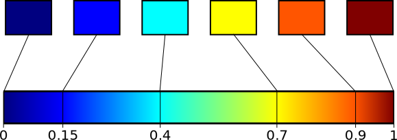

Drawing maps
============

In this section we describe the most complex part of the library, that
is the code that produces a graphical representation of a map. To
better understand the difficulties of such task, let us consider how
this is accomplished by the standard HEALPix library and by `Healpy
<https://github.com/healpy/healpy>`_, a Python wrapper to HEALPix. The
"standard" Healpix implementation is able to plot maps in a number of
ways:

* The IDL library contains roughly 7\,600 lines of code which
  implement :func:`MOLLVIEW` and similar functions. Such functions are
  written in pure IDL and use the IDL plotting functions.

* Two standalone programs, map2gif and map2tga, convert a map saved in
  a FITS file into a GIF/TGA image. The first one is written in
  Fortran90 and is roughly 1,200 lines of code, plus the source code
  of the gifdraw library (roughly 12,000 lines of code, in the
  directory :file:`src/f90/lib` of the tarball). The same figures
  apply to map2tga as well.

Because of this situation, the creators of the Healpy Python library
decided to implement a set of plotting routines from scratch. More
than 2,000 lines of code are needed to implement functions like
:func:`mollview` and :func:`mollzoom`; they are based on the
well-known `matplotlib <http://matplotlib.sourceforge.net/>`_ library.

Our approach is to implement a very generic interface for map plotting
in HPixLib (i.e. one that is agnostic to the tool actually used to
draw the map: Quartz, `Gtk+ <http://www.gtk.org/>`_, `Cairo
<http://www.cairographics.org>`_ …). Depending on the graphics
library, there are two possible approaches for drawing a map:

* Generate a bitmap. (This is the approach followed by the Healpix
  library and by Healpy.) The output of the process is a
  :math:`N\times M` matrix of pixels whose elements are calculated
  using a ray-tracing algorithm. The image has a fixed resolution,
  which implies that it shows poor results when enlarged. The
  ray-tracing algorithm has the advantage of being quite fast, and
  bitmaps can be displayed and saved quickly. When saved, the size of
  the file scales with the number of elements in the matrix, but it is
  independent of the number of pixels in the map.

* Generate a vector image. This solution has the drawback of producing
  very large files when *nside* is large, but vector maps scale very
  well when enlarged. The typical formats used to store such maps are
  Postscript and PDF.

HPixLib will provide two sets of functions to ease the production of
bitmapped and vector maps. (Such functions need to be wrapped with some
glue code which actually writes the map on disk or display it on the
screen.) Currently HPixLib supports the creation of bitmapped images;
the veneration of vector images is considered less important and will
be implemented in future releases of the library.

The library provides a program, map2fig, which is similar to the two
programs provided in the Healpix distribution, map2gif and map2tga.
However, being based on the Cairo graphics library, it allows to save
maps in vector formats as well. (The map itself is a bitmapped image
embedded in the EPS/PDF/SVG file, but the title, the color bar and
every other element is a vector.) This allows e.g. to modify these
maps within vector drawing programs like Inkscape or Adobe
Illustrator.

Introduction: a poor-man clone of map2fig
-----------------------------------------

We begin with a full example of how to use the drawing/palette
functions provided by HPixLib. The following program reads a map from
a file and then outputs to stdout a bitmap in PPM format
(http://netpbm.sourceforge.net/doc/ppm.html):

.. code-block:: c

  #include <stdio.h>
  #include <hpixlib/hpix.h>
     
  void output_map_to_file(const hpix_map_t * map,
  			    hpix_color_palette_t * palette,
  			FILE * out)
  {
      /* Keeping it double makes calculations more efficient */
      const double max_color_level = 255.0;
  
      hpix_bmp_projection_t * proj = 
  	hpix_create_bmp_projection(640, 320);
  
      double min, max;
      double * bitmap = hpix_bmp_to_mollweide_proj(proj, map, &min, &max);
  
      /* Write the PPM header */
      fprintf(out, "P3\n%u %u\n%u\n",
  	    hpix_bmp_projection_width(proj),
  	    hpix_bmp_projection_height(proj),
  	    (unsigned) max_color_level);
  
      double *restrict cur_pixel = bitmap;
      for(unsigned y = 0; y < hpix_bmp_projection_height(proj); ++y)
      {
  	for(unsigned x = 0; x < hpix_bmp_projection_width(proj); ++x)
  	{
  	    hpix_color_t pixel_color;
  	    hpix_palette_color(palette,
  			       (*cur_pixel++ - min) / (max - min),
  			       &pixel_color);
  	    fprintf(out, "%3u %3u %3u\t",
  		    (unsigned) (hpix_red_from_color(&pixel_color) * max_color_level),
  		    (unsigned) (hpix_green_from_color(&pixel_color) * max_color_level),
  		    (unsigned) (hpix_blue_from_color(&pixel_color) * max_color_level));
  	}
  
  	fputc('\n', out);
      }
    
      hpix_free(bitmap);
      hpix_free_bmp_projection(proj);
  }
  
  int main(int argc, const char ** argv)
  {
      if(argc != 2)
      {
  	fputs("You must specify the name of a FITS file on the command line\n",
  	      stderr);
  	return 1;
      }
  
      hpix_map_t * map;
      const char * file_name = argv[1];
      int status;
      if(! hpix_load_fits_component_from_file(file_name, 1, &map, &status))
      {
  	fprintf(stderr, "Unable to read map %s\n", file_name);
  	return 1;
      }
  
      hpix_color_palette_t * palette = hpix_create_planck_color_palette();
      output_map_to_file(map, palette, stdout);
      hpix_free_color_palette(palette);
      hpix_free_map(map);
  }

The typical usage is to produce a bitmap, then use *min_value* and
*max_value* to scale it from the map measure unit into a color space.
(You can find the source code of this program in the file
``examples/map2ppm.c``).

Bitmapped graphics
------------------

The interface provided by CHealpix for the generation of bitmapped
graphics clearly shows the ray-tracing algorithm on whom it is
grounded. In the following discussion we try to prevent the ambiguity
between a "pixel" in a Healpix map and a "pixel" in a bitmap by
referring to the second as "an element in the :math:`N \times M`
matrix," or "matrix element" for short. All the functions implemented
in this section have their name beginning with ``hpix_bmp_``.

.. c:type:: hpix_bmp_projection_t

   This type contains all the information needed to transform a
   Healpix map into a bi-dimensional bitmapped projection. It is an
   opaque structure, which means that you are not allowed to directly
   access/modify its members: you need to rely on functions defined in
   this section, like e.g. :c:func:`hpix_projection_width` and
   :c:func:`hpix_set_projection_width`.

.. c:function:: hpix_bmp_projection_t * hpix_create_bmp_projection(unsigned int width, unsigned int height)

   Create a new :c:type:`hpix_bmp_projection_t` object and initialize
   its width and height. This object must be deallocated using
   :c:func:`hpix_free_bmp_projection`.

.. c:function:: void hpix_free_bmp_projection(hpix_bmp_projection_t * proj)

Projection properties
---------------------

As said above, :c:type:`hpix_bmp_projection_t` is an opaque structure
and as such you cannot read/modify its members directly: you have to
use the facilities provided by the library.his.

.. c:function:: unsigned int hpix_projection_width(const hpix_bmp_projection_t * proj)

   Return the width of the bitmap, i.e. the number of columns.

.. c:function:: unsigned int hpix_projection_height(const hpix_bmp_projection_t * proj)

   Return the height of the bitmap, i.e. the number of rows.

.. c:function:: void hpix_set_projection_width(hpix_bmp_projection_t * proj, unsigned int width)

   Change the width of the bitmap.

.. c:function:: void hpix_set_projection_height(hpix_bmp_projection_t * proj, unsigned int height)

   Change the height of the bitmap.

Painting functions
------------------

.. c:function:: double * hpix_bmp_to_mollweide_proj(const hpix_bmp_projection_t * proj, const hpix_map_t * map, double * min_value, double * max_value)

   This function creates a bitmap (rectangular array of numbers)
   containing a Mollweide projection of *map*. The details of the
   projection are specified by the *proj* parameter (size of the
   bitmap, set of coordinates to be used and so on). The bitmap is an
   array of floating-point values, each using the same scale as in the
   original map (i.e. if the map represents a set of temperatures in
   Kelvin, then each pixel in the bitmap will be measured in Kelvin as
   well).

   Note that the Mollweide projection must have an aspect ratio 2:1,
   i.e., the width of the image should be twice its height. HPixLib
   does not enforce such requirement on the width and height of the
   bitmap, as the true aspect ratio of the image depends on the pixel
   aspect ratio of the device where the bitmap will be displayed as
   well. However, a good rule of thumb is to pick a width which is
   roughly twice the height, as most of the display devices in use
   today have a pixel aspect ratio which is close to 1:1.

   When the bitmap returned by this function is no longer useful, you
   must free it using :c:func:`hpix_free`.

Color palettes
--------------

Functions like :c:func:`hpix_bmp_to_mollweide_proj` create a bitmapped
representation of a map in which each matrix element of the bitmap is
expressed in the same units as the map (e.g., if a map represents some
measured sky flux in Jy, then the matrix elements of the bitmap will
be expressed in Jy too).

In order to properly display the bitmap on a device, HPixLib provides
a number of functions which convert floating-point values (in
arbitrary scales) into colors. Moreover, HPixLib is able to handle
color sets, called color palette, that represent gradients used to
attribute specific colors to each pixel in a map.

Color types and functions
'''''''''''''''''''''''''

The representation of colors used by HPixLib (through the type
:c:type:`hpix_color_t`) uses the classical RGB decomposition, i.e.,
each color is expressed as a mixture of red, green, and blue levels
(RGB), where each level is a floating-point value between 0.0
(absence) to 1.0 (saturation).

.. c:type:: hpix_color_t

    This type is a structure made up by three fields: `red`, `green`,
    and `blue`. Each element is a floating-point value normalized to
    unity.

    The value of the `red`, `green`, and `blue` fields should be
    between 0.0 (lack of shade) and 1.0 (saturated shade). HPixLib
    however does not enforce such limits, since it is quite common in
    computer graphics to represent saturated values using levels
    greater than 1.0. (E.g., this effect is used in ray-tracing
    programs like POV-Ray to create very bright light sources.)

    The structure is not opaque, therefore it can be created
    on-the-fly using the facilities of the C99 language:

.. code-block:: c

    /* This will work in C99, but not in C89 */
    hpix_color_t red_color =
        (hpix_color_t) { .red = 1.0, .green = 0.0, .blue = 0.0 };

Although the members of :c:type:`hpix_color_t` can be accessed
directly, HPixLib provides getter/setter functions in order to ease
the creation of binding libraries in other languages.

.. c:function:: hpix_color_t hpix_create_color(double red, double green, double blue)

    Return a :c:type:`hpix_color_t` structure initialized to the
    specified values of red, green, and blue.

.. c:function:: hpix_red_from_color(const hpix_color_t * color)

    Return the red level of the color.

.. c:function:: hpix_green_from_color(const hpix_color_t * color)

    Return the green level of the color.

.. c:function:: hpix_blue_from_color(const hpix_color_t * color)

    Return the blue level of the color.

Color palettes
''''''''''''''

A color palette is a set of colors and rules which specify how to
combine the colors in order to provide a continuous and smooth
palette. The idea is that every floating-point number falling within
some predefined range can then be converted into a RGB color and
displayed on a device.

:ref:`figlem` shows an example. The palette is made by six colors,
each with an associated floating-point number between 0 and 1. The
library is able to blend the colors (using linear interpolation) to
produce a smooth transition between them. The programmer can create
custom color palettes using the functions described in this section.

.. _figlem:

    The original Healpix color palette

.. c:type:: hpix_color_palette_t

    The type :c:type:`hpix_color_palette_t` is an opaque type that
    holds the information which represents a color palette:

       #. An array of levels and colors (:c:type:`hpix_color_t`). This
          array always contains at least two elements: the one at level 0
          (left side) and the one at level 1 (right side).

       #. The color to be used for unseen pixels.

    HPixLib provides a few functions that create nice-looking palettes
    ready to use: :c:func:`hpix_create_grayscale_color_palette` and
    :c:func:`hpix_create_healpix_color_palette`. When a palette is no
    longer used, the program must call
    :c:func:`hpix_free_color_palette`.

    Note that, being an opaque type, :c:type:`hpix_color_palette_t`
    can be accessed only using the setter/getter functions described
    here.

.. c:function:: hpix_color_palette_t * hpix_create_black_color_palette(void)

    Create a black color palette. This is never used in real-world
    examples, but it can be a good starting point for creating custom
    palettes using :c:func:`hpix_set_color_for_step_in_palette` and
    :c:func:`hpix_add_step_to_color_palette`.

    When the palette is no longer used, the program must call
    :c:func:`hpix_free_color_palette`.

.. c:function:: hpix_color_palette_t * hpix_create_grayscale_color_palette(void)

    Create a color palette made by gray shades. (The color used for
    unseen pixels has a reddish tint, in order to make it
    distinguishable from the others.)

    When the palette is no longer used, the program must call
    :c:func:`hpix_free_color_palette`.

.. c:function:: hpix_color_palette_t * hpix_create_healpix_color_palette(void)

    Create a color palette that mimics the one used by the original
    Healpix library. When the palette is no longer used, the program
    must call :c:func:`hpix_free_color_palette`.

.. c:function:: hpix_color_palette_t * hpix_create_planck_color_palette(void)

    Create a color palette that mimics the one used in the first
    Planck data release. When the palette is no longer used, the
    program must call :c:func:`hpix_free_color_palette`.

.. c:function:: void hpix_free_color_palette(hpix_color_palette_t * palette)

    Release any memory associated with the palette.

The color to be used for unseen/masked/bad pixels can be read using
:c:func:`hpix_color_for_unseen_pixels_in_palette` and set using
:c:func:`hpix_set_color_for_unseen_pixels_in_palette`.

.. c:function:: void hpix_set_color_for_unseen_pixels_in_palette(hpix_color_palette_t * palette, hpix_color_t new_color)

    Set the color to be used for unseen pixels in the specified palette.

.. c:function:: hpix_color_t hpix_set_color_for_unseen_pixels_in_palette(hpix_color_palette_t * palette)

    Retrieve from the palette the color to be used for unseen pixels.

It is possible to add color levels and to modify the existing ones.
Note however that it is not possible to delete levels from a
:c:type:`hpix_color_palette_t` variable.

.. c:function:: void hpix_add_step_to_color_palette(hpix_color_palette_t * palette, double level, hpix_color_t color)

    Add a new color and a new level to the color palette. The new
    color will be appended to the list of existing color steps. Before
    using the palette, you must ensure that
    :c:func:`hpix_sort_levels_in_color_palette` has been called, so
    that all the levels are in ascending order.

    Note that the code does not check if the level you are specifying
    in the call is already present in the palette. If this is the
    case, the library might behave unexpectedly (including divisions
    by zero).

.. c:function:: size_t hpix_num_of_steps_in_color_palette(const hpix_color_palette_t * palette)

    Return the number of color steps in the palette. This number is
    useful if you want to cycle over the steps using e.g. calls to
    :c:func:`hpix_color_for_step_in_palette` and
    :c:func:`hpix_level_for_step_in_palette`.

.. c:function:: hpix_color_t hpix_color_for_step_in_palette(const hpix_color_palette_t * palette, size_t zero_based_index)

    Return the color associated with the given step in the palette.
    The value of `zero_based_index` ranges from 0 to the value
    returned by :c:func:`hpix_num_of_steps_in_color_palette`.

.. c:function:: double hpix_level_for_step_in_palette(const hpix_color_palette_t * palette, size_t zero_based_index)

    Return the level associated with the given step in the palette.
    This level should always be between 0.0 and 1.0. The value of
    `zero_based_index` ranges from 0 to the value returned by
    :c:func:`hpix_num_of_steps_in_color_palette`.

.. c:function:: void hpix_set_color_for_step_in_palette(hpix_color_palette_t * palette, size_t zero_based_index, hpix_color_t new_color)

    Change the color associated with the given step in the palette.

    See also :c:func:`hpix_color_for_step_in_palette`.

.. c:function:: void hpix_set_level_for_step_in_palette(hpix_color_palette_t * palette, size_t zero_based_index, double new_level)

    Change the level associated with the given step in the palette.
    Use with care! You must ensure that the new level does not
    coincide with other levels in the palette, and that the first and
    last level in the array of steps are still 0.0 and 1.0.

    See also :c:func:`hpix_level_for_step_in_palette`.

Here is an example of how to use these functions to dump the
definition of a palette to `stdout`:

.. code-block:: c

    size_t num_of_steps = hpix_num_of_steps_in_color_palette(palette);

    for(size_t index = 0; index < num_of_steps; ++index)
    {
        double level = hpix_level_for_step_in_palette(palette, index);
	hpix_color_t color = hpix_color_for_step_in_palette(palette, index);

        printf("Level: %.2f   -- R: %.2f, G: %.2f, B: %.2f\n",
               color.red, color.green, color.blue);
    }

If `palette` were the result of a call to
:c:func:`hpix_create_healpix_color_palette`, the output of the code
above would have been the following::

    Level: 0.00   -- R: 0.00, G: 0.00, B: 0.50
    Level: 0.15   -- R: 0.00, G: 0.00, B: 1.00
    Level: 0.40   -- R: 0.00, G: 1.00, B: 1.00
    Level: 0.70   -- R: 1.00, G: 1.00, B: 0.00
    Level: 0.90   -- R: 1.00, G: 0.33, B: 0.00
    Level: 1.00   -- R: 0.50, G: 0.00, B: 0.00

.. c:function:: void hpix_sort_levels_in_color_palette(hpix_color_palette_t * palette)

    Sort all the steps in the palette in increasing order with respect
    to their level. (The sort is done inplace using the Standard C
    library function `qsort`: depending on the implementation, it
    might require or not additional memory.)

    Sorting the steps in the palette is crucial for allowing the
    algorithm implemented in :c:func:`hpix_palette_color` to work.
    For efficiency reasons, the function is *never* called
    automatically by HPixLib.

.. c:function:: hpix_palette_color(const hpix_color_palette_t * palette, double level, hpix_color_t * color)

    Set the fields of *color* so that it represents the specified
    `level` in the given color palette. The function uses a linear
    interpolation of the color steps in the palette.

    The palette must be properly sorted using
    :c:func:`hpix_sort_levels_in_color_palette`. This condition is
    already satisfied for the palettes returned by
    :c:func:`hpix_create_black_color_palette`,
    :c:func:`hpix_create_grayscale_color_palette`, and
    :c:func:`hpix_create_healpix_color_palette`.

Before using a palette in a
call to :c:func:`hpix_get_color_palette` or any function that
implicitly calls it (e.g.,
:c:func:`hpix_bmp_mollweide_proj_to_cairo_surface`), you must ensure
these rules apply:

    #. The first color step in the palette has level 0.

    #. The last color step in the palette has level 1.

    #. All the color steps are sorted in increasing order according to
       their level.

    #. There must not be two color steps with the same value for the
       level.

HPixLib does not enforce any of these rules. To ensure that you comply
with them, here is a set of rules:

    * After you call :c:func:`hpix_add_step_to_color_palette`, call
      :c:func:`hpix_sort_levels_in_color_palette` to sort the list. If
      you make multiple calls to
      :c:func:`hpix_add_step_to_color_palette`, you can sort the list
      after the last call (which is very efficient).

    * Never use :c:func:`hpix_set_level_for_step_in_palette` to change
      the level of the color steps with level 0.0 and 1.0.

    * When adding new color steps with
      :c:func:`hpix_add_step_to_color_palette`, ensure that the level
      you are specifing was never used in the palette.

    * If you want to change the color at one of the edges of the
      palette, the right way to do is to call
      :c:func:`hpix_set_color_for_step_in_palette`, as shown in the
      following example:

.. code-block:: c

    /* This might be unnecessary, but it does not harm. */
    hpix_sort_levels_in_color_palette(palette);

    size_t num_of_steps = hpix_num_of_steps_in_color_palette(palette);

    /* Change the color for level 0 */
    hpix_set_color_for_step_in_palette(0, hpix_create_color(0.0, 1.0, 1.0));
    /* Change the color for level 1 */
    hpix_set_color_for_step_in_palette(num_of_steps - 1, hpix_create_color(1.0, 1.0, 1.0));

Vector graphics
---------------

Not implemented yet.
